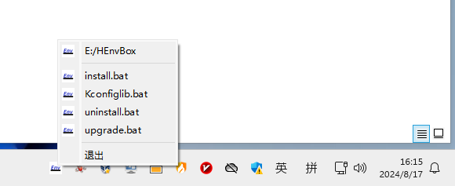
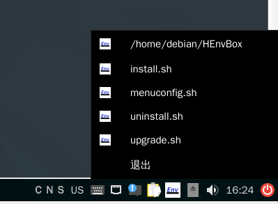

# 说明

本程序为采用Qt库编写的托盘程序，方便快速调用环境的某些功能。

# 源代码

源代码目录:[HEnvBoxTray](HEnvBoxTray)

源代码采用CMake管理，可使用qtcreator直接打开。

# 编译

编译本程序需要安装好Qt库及编译环境(包含CMake)。

通常情况下，若已成功安装HEnvBox，那么环境就已被配置好，但需要注意的是在Windows下不能使用cmd环境与MSYS2 MSYS环境，推荐在Windows下使用MSYS2 UCRT64环境。

可使用以下命令编译：

```bash
#创建目录并进入
mkdir build
cd build
#配置
cmake ../HEnvBoxTray
#编译,编译完成后即可得到托盘程序
cmake --build .
```

# 自动启动

注意：自动启动的步骤是紧接着编译的步骤的，设置自动启动时需要先编译成功。

## Linux桌面环境

注意：

- 桌面环境需要支持自动启动/etc/xdg/autostart目录下的文件,具体见[autostart-spec](https://specifications.freedesktop.org/autostart-spec/0.5/)。

- 自动启动不支持卸载，如需卸载则需要手动清理/etc/xdg/autostart目录。

```bash
#安装
sudo cmake --build . -t install
```


# 截图

## windows



## debian



