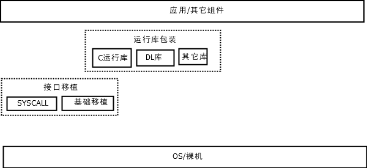

# 说明

本组件主要提供一些定义及函数。

本组件主要用于提供统一访问OS接口的接口,其它组件一般不直接与OS接口打交道。

一般情况下，一个MCU（不带MMU/MPU）基本工程只有一个程序。

但在某些情况下，需要把一个MCU(不带MMU/MPU）程序分为多个部分（通常是基于许可或者保密要求），每个部分可单独开发，此时可使用本组件的`usercall`+API表的机制（以分为Kernel与App两部分为例，启动App程序时，将API表设置为Kernel的API表，此时App可通过`usercall`访问Kernel的资源）。

本工具箱的可移植部分通常在本组件中进行。

# 基础移植

基础移植表示本组件提供的基本接口。

可提供的函数如下：

|                             函数                             |      说明      |                             备注                             |
| :----------------------------------------------------------: | :------------: | :----------------------------------------------------------: |
|         `hdefaults_tick_t hdefaults_tick_get(void)`          |  默认节拍获取  |                                                              |
|     `void * hdefaults_malloc(size_t nBytes,void *usr);`      |  默认内存分配  |                                                              |
|         `void hdefaults_free(void *ptr,void *usr);`          |  默认内存释放  |                                                              |
|           `void  hdefaults_mutex_lock(void *usr);`           | 默认互斥锁加锁 | 通常在实现时使用临界区实现,如需使用互斥锁，必须使用支持递归的互斥锁 |
|          `void  hdefaults_mutex_unlock(void *usr);`          | 默认互斥锁解锁 | 通常在实现时使用临界区实现，如需使用互斥锁，必须使用支持递归的互斥锁 |
|  `void * hdefaults_symbol_find(const char * symbol_name);`   |  默认符号查找  |            可用于查找自身符号，默认采用libdl库。             |
| `const hdefaults_api_table_t * hdefaults_get_api_table(void);` |   获取API表    |                                                              |
| `const hdefaults_api_table_t * hdefaults_set_api_table(const hdefaults_api_table_t* new_api_table);` |   修改API表    |               一般情况下，只在程序初始化时调用               |
|          `hdefaults_usercall(usercall_number,...)`           |    用户调用    |           一般不直接使用，用于封装`usercall`调用。           |

提供的宏定义如下:

|           宏定义            | 说明                             | 备注                                                         |
| :-------------------------: | :------------------------------- | :----------------------------------------------------------- |
|     `hdefaults_xstr(s)`     | 宏函数,将符号s的内容转换为字符串 |                                                              |
|     `hdefaults_str(s)`      | 宏函数,将符号s转换为字符串       |                                                              |
|  `HDEFAULTS_BITS_16_OR_8`   | 16位/8位环境                     | 不保证代码在此环境可用                                       |
|     `HDEFAULTS_BITS_32`     | 32位环境                         |                                                              |
|     `HDEFAULTS_BITS_64`     | 64位环境                         |                                                              |
|  `HDEFAULTS_BITS_ABOVE_64`  | 高于64位的环境                   | 不保证代码在此环境可用                                       |
|    `HDEFAULTS_ARCH_X86`     | 架构为x86                        |                                                              |
|   `HDEFAULTS_ARCH_X86_64`   | 架构为x86_64                     |                                                              |
|  `HDEFAULTS_ARCH_AARCH64`   | 架构为aarch64                    |                                                              |
|    `HDEFAULTS_ARCH_ARM`     | 架构为ARM                        |                                                              |
| `HDEFAULTS_ARCH_ARM_THUMB`  | 架构为Thumb                      | 在编译Thumb代码时会定义此宏定义，通常也会定义`HDEFAULTS_ARCH_ARM` |
|   `HDEFAULTS_ARCH_RISCV`    | 架构为RISCV                      |                                                              |
|  `HDEFAULTS_ARCH_RISCV32`   | 架构为RISCV(32位)                | 通常也会定义`HDEFAULTS_ARCH_RISCV`                           |
|  `HDEFAULTS_ARCH_RISCV64`   | 架构为RISCV(64位)                | 通常也会定义`HDEFAULTS_ARCH_RISCV`                           |
|    `HDEFAULTS_ARCH_WASM`    | 架构为WASM                       |                                                              |
|   `HDEFAULTS_ARCH_WASM32`   | 架构为WASM(32位)                 | 通常也会定义`HDEFAULTS_ARCH_WASM`                            |
|   `HDEFAULTS_ARCH_WASM64`   | 架构为WASM(64位)                 | 通常也会定义`HDEFAULTS_ARCH_WASM`                            |
|   `HDEFAULTS_ARCH_XTENSA`   | 架构为XTENSA                     |                                                              |
|  `HDEFAULTS_PLATFORM_ESP`   | 平台为ESP                        |                                                              |
|   `HDEFAULTS_OS_RTTHREAD`   | 处于RT-Thread中                  |                                                              |
|    `HDEFAULTS_OS_NUTTX`     | 处于NuttX中                      |                                                              |
|   `HDEFAULTS_OS_WINDOWS`    | 处于Windows中                    |                                                              |
|     `HDEFAULTS_OS_UNIX`     | 处于UNIX(类UNIX中)               |                                                              |
|   `HDEFAULTS_OS_FREEBSD`    | 处于FreeBSD中                    | 通常也会定义`HDEFAULTS_OS_UNIX`                              |
|    `HDEFAULTS_OS_LINUX`     | 处于Linux中                      | 通常也会定义`HDEFAULTS_OS_UNIX`                              |
|   `HDEFAULTS_OS_ANDROID`    | 处于Android中                    | 通常也会定义`HDEFAULTS_OS_UNIX`、`HDEFAULTS_OS_LINUX`        |
|    `HDEFAULTS_OS_CYGWIN`    | 处于Cygwin中                     | 通常也会定义`HDEFAULTS_OS_UNIX`                              |
|  `HDEFAULTS_OS_EMSCRIPTEN`  | 处于emscripten中                 | 通常也会定义`HDEFAULTS_OS_UNIX`                              |
|     `HDEFAULTS_OS_NONE`     | 无操作系统                       | 通常为裸机开发，也可用于某些SDK中裸机应用开发（有操作系统但应用不可见，且无MMU/MPU内存管理的情况）。 |
|   `HDEFAULTS_LIBC_NEWLIB`   | C库采用Newlib                    | Newlib常用于裸机开发。与常见的C库不同，通常情况下，用作裸机开发时需要用户移植部分系统调用。Newlib也被用于[Cygwin](https://cygwin.com/)与[MSYS2](https://www.msys2.org/)，此环境下无需用户进行移植。 |
|  `HDEFAULTS_LIBC_PICOLIBC`  | C库采用picolibc                  | [picolibc](https://github.com/picolibc/picolibc)是一个为32位/64位嵌入式系统设计的C库。其混合了Newlib与AVR libc,故而一般也会定义`HDEFAULTS_LIBC_NEWLIB`。 |
|   `HDEFAULTS_LIBC_MINGW`    | C库采用mingw                     | mingw通常采用[mingw-w64](https://www.mingw-w64.org/)版本，常用于Windows(或者兼容环境如[Wine](https://www.winehq.org/))。使用GCC/LLVM编译Windows程序时通常使用此C库。与其作用类似的为MSVC的C库。 |
|    `HDEFAULTS_LIBC_MSVC`    | C库采用MSVC自带C库。             | 一般用于Windows程序。                                        |
|   `HDEFAULTS_LIBC_GLIBC`    | C库采用glibc                     | [glibc](https://www.gnu.org/software/libc/)是大多数Linux发行版采用的C库。与其作用类似的为[musl](http://musl.libc.org/)、uClibc。一般在Linux操作系统环境下，若未采用glibc，大概率采用musl或uClibc作为C库。 |
|    `HDEFAULTS_LIBC_MUSL`    | C库采用musl                      | [musl](http://musl.libc.org/)通常用于轻量级场景（如容器、嵌入式Linux），其体积一般相较glibc小，但其某些行为可能与glibc不同。 |
|   `HDEFAULTS_LIBC_UCLIBC`   | C库采用uClibc                    | uclibc常采用[uClibc-ng](https://uclibc-ng.org/)版本。uClibc是一个用于嵌入式Linux系统的C库，其体积较小。通常也会定义`HDEFAULTS_LIBC_GLIBC` |
|  `HDEFAULTS_LIBC_ARMCLIB`   | C库采用ARM Compiler的C库         | ARM Compiler常见于Keil MDK。一般用于ARM架构的MCU开发。       |
|    `HDEFAULTS_LIBC_ICC`     | C库采用IAR的C库                  | IAR是一种开发工具。ARM IAR可用于ARM架构的MCU开发。           |
| `HDEFAULTS_LIBC_ANDROIDNDK` | C库采用android ndk               | 通常用于Android系统                                          |

可外部配置的宏定义如下:

|          宏定义          |                             说明                             |                             备注                             |
| :----------------------: | :----------------------------------------------------------: | :----------------------------------------------------------: |
|   `HDEFAULTS_TICK_GET`   |               默认获取节拍(毫秒)函数名称宏定义               |                                                              |
|    `HDEFAULTS_MALLOC`    |                  默认内存分配函数名称宏定义                  |                                                              |
|     `HDEFAULTS_FREE`     |                  默认内存释放函数名称宏定义                  |                                                              |
|  `HDEFAULTS_MUTEX_LOCK`  | 默认互斥锁加锁函数(无参数，无返回值)名称宏定义,要求锁支持递归。 | 一般用于嵌入式编程,一般使用临界区实现。对于无操作系统的环境,可采用计数+开中断的方式实现(参考rt-thread)。 |
| `HDEFAULTS_MUTEX_UNLOCK` | 默认互斥锁解锁函数(无参数，无返回值)名称宏定义，要求锁支持递归。 | 一般用于嵌入式编程,一般使用临界区实现。对于无操作系统的环境,可采用计数+关中断的方式实现(参考rt-thread)。 |
|      `HAVE_DLFCN_H`      |                  当前环境有`dlfcn.h`头文件                   | 使用`CMake`时自动判断，其它构建工具需自行根据实际情况添加。  |
|    `HAVE_SYS_MMAN_H`     |                 当前环境有`sys/mman.h`头文件                 | 使用`CMake`时自动判断，其它构建工具需自行根据实际情况添加。  |
|     `HAVE_UNISTD_H`      |                  当前环境有`unistd.h`头文件                  | 使用`CMake`时自动判断，其它构建工具需自行根据实际情况添加。  |
|      `HAVE_FCNTL_H`      |                  当前环境有`fcntl.h`头文件                   | 使用`CMake`时自动判断，其它构建工具需自行根据实际情况添加。  |
|     `HAVE_THREADS_H`     |                 当前环境有`threads.h`头文件                  | 使用`CMake`时自动判断，其它构建工具需自行根据实际情况添加。  |
|    `HAVE_STDATOMIC_H`    |                当前环境有`stdatomic.h`头文件                 | 使用`CMake`时自动判断，其它构建工具需自行根据实际情况添加。  |
|        `FREERTOS`        |                    当前环境支持`FreeRTOS`                    | 通常用于外部支持的`FreeRTOS`,使用内置`FreeRTOS`内核(见[h3rdparty](../h3rdparty))时无需定义。启用此定义后，需要在配置头文件中包含`FreeRTOS`头文件（由于某些环境的头文件与官方的不一致，因此需要用户手动实现） |

# 系统调用

本组件允许对常用的系统调用进行包装。

这部分是可选的（如需使用则需要处理失败的情况）,具体实现需要根据具体的环境进行调整。

最小实现时可不实现相关系统调用。

系统调用相关实现见[syscall](syscall)。

# C运行库

对于某些环境(如裸机)而言，并不是所有的C运行库中的函数均可用，有些需要进行一定移植或者包装。

C运行库包装相关实现见[libc](libc)。

# 动态库

某些情况下，进行动态库的加载是十分常见的操作，此处提供统一的接口进行操作。

动态库操作见[libdl](libdl)。

