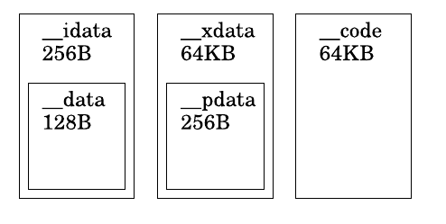

# 说明

本目录主要用于实现MCS-51模拟器。

对于非嵌入式平台可采用SDCC自带的[ucsim](https://www.ucsim.hu/)工具。

本目录参考以下模拟器代码：

- [ucsim](https://www.ucsim.hu/)：微控制器软件模拟器。
- [emu8051](https://github.com/jarikomppa/emu8051.git):基于curses的8051/8052模拟器。
- [emu8051](http://www.hugovil.com/projet.php?proj=emu8051):8051模拟器，支持CLI与GUI。此软件被debian系操作系统收录，可使用`apt`命令安装。

# 编译器/开发环境

- Keil C51:MCS-51 集成开发环境。
- [SDCC](https://sdcc.sourceforge.net/)：支持MCS-51的编译器。
- [mcu8051ide](https://sourceforge.net/projects/mcu8051ide/):MCS-51 集成开发环境,采用SDCC，支持模拟器，支持外设（如LED显示）。

编译器推荐使用SDCC，可采用部分较新的C语言特性。

# 模型

注意：此章节的说明适用于SDCC,不适用于Keil C51。

## 地址空间

- 内部RAM地址空间：`__data、__idata`
- 外部RAM地址空间:`__xdata、__pdata`
- 程序ROM地址空间:`__code`

## 内存模型

内存模型只影响默认的变量分配（如参数与局部变量），若用户指定变量存储位置，则不受影响。

### 极简模型

- 128字节RAM(只可直接寻址)
- 128字节SFR(只可直接寻址)
- ROM空间不限（小于64KB）

此模型没有特定的编译器选项，可使用`--model-small  --iram-size 128`指定此模型。

### model-small

- 256字节RAM（高128字节需要间接寻址,低128字节可直接寻址也可间接寻址）
- 128字节SFR(只可直接寻址)
- ROM空间不限（小于64KB）

可使用`--model-small  --iram-size 256`指定此模型。

### model-medium

- 256字节RAM（高128字节需要间接寻址,低128字节可直接寻址也可间接寻址）
- 256字节外部RAM(也可小于256字节)
- 128字节SFR(只可直接寻址)
- ROM空间不限（小于64KB）

可使用`--model-medium  --xram-size 外部RAM字节数`指定此模型。

### model-large

- 256字节RAM（高128字节需要间接寻址,低128字节可直接寻址也可间接寻址）
- 64KB外部RAM(可小于64KB)
- 128字节SFR(只可直接寻址)
- ROM空间不限（小于64KB）

可使用`--model-large  --xram-size 外部RAM字节数`指定此模型。

### model-huge

- 256字节RAM（高128字节需要间接寻址,低128字节可直接寻址也可间接寻址）
- 64KB外部RAM(可小于64KB)
- 128字节SFR(只可直接寻址)
- ROM空间不限（大于64KB，ROM空间被分为两块，0-0x7FFF的映射不可改变,0x8000-0xFFFF可通过某个SFR切换映射关系以突破64KB限制）

可使用`--model-huge  --xram-size 外部RAM字节数`指定此模型。

## 时钟

默认情况下，主时钟频率为11.0592M。

用户可通过宏定义`HS_MCS_51_COMMON_CLK_FREQ` 修改此值。

注意：此时钟仅用于某些外设（如串口、定时器等）的计算，并不要求模拟器的时钟节拍的调用频率一定为此时钟频率。

## 基础外设(8031/8051外设)

MCS-51的经典外设如下:

- 定时器：至少2个16位定时器。
- 串口:具有一个串口外设。

对于各种基于8051内核的单片机而言，或许有更多类型的外设，但不在此章节描述。

### 串口

#### 寄存器概述

| 名称 | SFR地址 | 说明                                         |
| :--: | :-----: | :------------------------------------------- |
| SCON |   98H   | 串口控制                                     |
| PCON |   87H   | 电源控制                                     |
|  IE  |   A8H   | 中断使能                                     |
|  IP  |   B8H   | 中断优先级                                   |
| SBUF |   99H   | 串口缓冲，写入/读取此寄存器表示发送/接收数据 |

#### SCON

| 名称 | 位(相对与寄存器) | 说明                                                         |
| :--: | :--------------: | ------------------------------------------------------------ |
| SM0  |        7         | 与SM1共同选择工作模式。                                      |
| SM1  |        6         | 与SM0共同选择工作模式。模式0=同步位移模式，模式1=8位UART(波特率可变)，模式2=9位UART，模式3=9位UART(波特率可变)。可变波特率时由定时器决定波特率。 |
| SM2  |        5         | 在工作模式2与3时，选择多机通信还是单机通信，SM2=1时选择多机模式，SM2=0时选择双机模式。模式0需要清0。多机模式下，只接收RB8=1的地址数据。 |
| REN  |        4         | 接收使能。REN=1时允许接收。                                  |
| TB8  |        3         | 发送数据第9位。                                              |
| RB8  |        2         | 接收数据第9位。                                              |
|  TI  |        1         | 发送中断请求。TI=1时有中断请求。                             |
|  RI  |        0         | 接收中断请求。RI=1时有中断请求。                             |

注意:

- 双机（一对一）模式下,SM2必须清零。
- 多机(一主多从)模式下,主机发送地址数据时,SM2必须置位,接收数据时SM2必须清零，从机必须先将SM2置位接收地址数据，当接收到正确的地址后，从机才可以将SM2清零接收普通数据。

#### PCON

| 名称 | 位(相对于寄存器) | 说明                 |
| :--: | :--------------: | -------------------- |
| SMOD |        7         | SMOD=1，波特率加倍。 |

注意:

- 只描述串口相关位

#### IE

| 名称 | 位(相对于寄存器) | 说明                             |
| :--: | :--------------: | -------------------------------- |
|  EA  |        7         | 全局中断使能。EA=1全局开中断。   |
|  ES  |        4         | 串口中断使能。ES=1使能串口中断。 |

注意:

- 只描述串口相关位

#### IP

| 名称 | 位(相对于寄存器) | 说明                                       |
| :--: | :--------------: | ------------------------------------------ |
|  PS  |        4         | 串口中断优先级。PS=1时串口为高优先级中断。 |

注意:

- 只描述串口相关位

#### SBUF

8位串口数据。写入代表发送数据，读取表示接收数据。

### 外部中断与定时器0/1

#### 寄存器概述

| 名称 | SFR地址 | 说明                  |
| :--: | :-----: | :-------------------- |
| TCON |   88H   | 定时器/计数器控制     |
| TMOD |   89H   | 定时器/计数器模式控制 |
| TL0  |   8AH   | 定时器0低8位          |
| TL1  |   8BH   | 定时器1低8位          |
| TH0  |   8CH   | 定时器0高8位          |
| TH1  |   8DH   | 定时器1高8位          |
|  IE  |   A8H   | 中断使能              |
|  IP  |   B8H   | 中断优先级            |

#### TCON

| 名称 | 位(相对于寄存器) | 说明                                                 |
| :--: | :--------------: | ---------------------------------------------------- |
| TF1  |        7         | 定时器1溢出标志。当中断过程结束时自动清0。           |
| TR1  |        6         | 定时器1运行控制。                                    |
| TF0  |        5         | 定时器0溢出标志。当中断过程结束时自动清0。           |
| TR0  |        4         | 定时器0运行控制。                                    |
| IE1  |        3         | 外部中断1标志。当中断过程结束时自动清0(边沿触发时)。 |
| IT1  |        2         | 外部中断1类型控制。1=下降沿，0=低电平。              |
| IE0  |        1         | 外部中断0标志。当中断过程结束时自动清0(边沿触发时)。 |
| IT0  |        0         | 外部中断0类型控制。1=下降沿，0=低电平。              |

#### TMOD

| 名称 | 位(相对于寄存器) | 说明                                                         |
| :--: | :--------------: | ------------------------------------------------------------ |
|  G1  |        7         | 定时器1门控位。1=定时器由TR1与INT1引脚(高电平有效)共同控制(与)，0=定时器由TR1控制。 |
| CT1  |        6         | 定时器1功能选择位。1=计数器(对外部信号脉冲计数)，0=定时器(对时钟信号计数)。 |
| M11  |        5         | 定时器1工作模式位1,与M10共同选择工作模式。                   |
| M10  |        4         | 定时器1工作模式位0,与M11共同选择工作模式。0=13位定时器/计数器,1=16位定时器/计数器,2=8位自动重装载定时器/计数器,3=两个8位定时器/计数器。 |
|  G0  |        3         | 定时器0门控位。1=定时器由TR0与INT0引脚(高电平有效)共同控制(与)，0=定时器由TR0控制。 |
| CT0  |        2         | 定时器0功能选择位。1=计数器(对外部信号脉冲计数)，0=定时器(对时钟信号计数)。 |
| M01  |        1         | 定时器0工作模式位1,与M00共同选择工作模式。                   |
| M00  |        0         | 定时器0工作模式位0,与M01共同选择工作模式。0=13位定时器/计数器,1=16位定时器/计数器,2=8位自动重装载定时器/计数器,3=定时器停止。 |

#### TL0

定时器0低八位。

#### TL1

定时器1低八位。

#### TH0

定时器0高八位。当工作在工作模式2时，TH0为自动重装载的值。

#### TH1

定时器1高八位。当工作在工作模式2时，TH1为自动重装载的值。

#### IE

| 名称 | 位(相对于寄存器) | 说明                            |
| :--: | :--------------: | ------------------------------- |
|  EA  |        7         | 全局中断使能。EA=1全局开中断。  |
| ET1  |        3         | 定时器1中断使能。1=启用中断。   |
| EX1  |        2         | 外部中断1中断使能。1=启用中断。 |
| ET0  |        1         | 定时器0中断使能。1=启用中断。   |
| EX0  |        0         | 外部中断0中断使能。1=启用中断。 |

注意:

- 只描述本章节相关位

#### IP

| 名称 | 位(相对于寄存器) | 说明                              |
| :--: | :--------------: | --------------------------------- |
| PT1  |        3         | 定时器1中断优先级。1=高优先级。   |
| PX1  |        2         | 外部中断1中断优先级。1=高优先级。 |
| PT0  |        1         | 定时器0中断优先级。1=高优先级。   |
| PX0  |        0         | 外部中断0中断优先级。1=高优先级。 |

注意:

- 只描述本章节相关位

### 中断

#### 中断号

`MCS-51中断地址=(中断号*8)+3`,当需要执行中断过程时需要跳到中断地址。

| 名称 | 中断号 | 说明      |
| :--: | :----: | --------- |
| IE0  |   0    | 外部中断0 |
| TF0  |   1    | 定时器0   |
| IE1  |   2    | 外部中断1 |
| TF1  |   3    | 定时器1   |
| SI0  |   4    | 串口0中断 |

注意：

- 地址0为复位时跳转的地址(类似其它架构的复位中断)，一般在此放一条长跳转指令。

#### 中断优先级

中断优先级由相应寄存器(IP)设置。

最终的优先级顺序：

- 高优先级中断高于低优先级中断。
- 同一级优先级中断的执行顺序由硬件扫描顺序决定。

中断执行规则：

- 中断不能被低优先级/同一优先级中断打断。
- 高优先级中断可打断低优先级中断。

### IO端口

| 名称 | sfr地址 | 说明                                      |
| :--: | :-----: | ----------------------------------------- |
|  P0  |   80H   | 此IO端口可位寻址,即单独对某一个引脚操作。 |
|  P1  |   90H   | 此IO端口可位寻址,即单独对某一个引脚操作。 |
|  P2  |   A0H   | 此IO端口可位寻址,即单独对某一个引脚操作。 |
|  P3  |   B0H   | 此IO端口可位寻址,即单独对某一个引脚操作。 |

#### 8位数据总线

P0口可作为8位数据总线。

#### 16位地址总线

P0口可复用为16位地址总线低8位。

P2口可复用为16地址总线的高8位。

#### 特殊功能复用

| 功能 | 位地址 | 说明      |
| :--: | :----: | --------- |
|  RD  |  B7H   | P3口引脚7 |
|  WR  |  B6H   | P3口引脚6 |
|  T1  |  B5H   | P3口引脚5 |
|  T0  |  B4H   | P3口引脚4 |
| INT1 |  B3H   | P3口引脚3 |
| INT0 |  B2H   | P3口引脚2 |
| TXD  |  B1H   | P3口引脚1 |
| RXD  |  B0H   | P3口引脚0 |

### 80C51增强功能

#### PCON 增强功能

PCON的SFR地址为87H。

| 名称 | 位(相对于寄存器) | 说明                                                |
| :--: | :--------------: | --------------------------------------------------- |
| GF1  |        3         | 通用标志1，由用户决定用途。                         |
| GF0  |        2         | 通用标志2，由用户决定用途。                         |
|  PD  |        1         | 掉电模式。1=进入掉电模式。由复位清除。              |
| IDL  |        0         | 空闲模式标志。1=空闲模式，当有中断/复位发生时清除。 |

注意：

- 只描述增强的功能。

## 8032/8052外设

除了基础外设之外,8032/8052新增如下功能：

- 定时器2

注意：本章节只描述新增的功能。

### 定时器2

#### 寄存器概览

|  名称  | sfr地址 | 说明                       |
| :----: | :-----: | -------------------------- |
| T2CON  |   C8H   | 定时器/计数器2控制器寄存器 |
| RCAP2L |   CAH   | 捕获/重装载值低8位         |
| RCAP2H |   CBH   | 捕获/重装载值高8位         |
|  TL2   |   CCH   | 定时器2低8位               |
|  TH2   |   CDH   | 定时器2高8位               |
|   IE   |   A8H   | 中断使能                   |
|   IP   |   B8H   | 中断优先级                 |

#### T2CON

| 名称  | 位(相对于寄存器) | 说明                                                         |
| :---: | :--------------: | ------------------------------------------------------------ |
|  TF2  |        7         | 定时器2溢出标志                                              |
| EXF2  |        6         | 通过T2EX的负跳变触发捕获/重装时置位，将触发定时器2中断（若使能了定时器2中断）。 |
| RCLK  |        5         | 接收时钟。1=替代定时器1作为串口接收时钟。                    |
| TCLK  |        4         | 发送时钟。1=替代定时器1作为发送接收时钟。                    |
| EXEN2 |        3         | 定时器外部使能。0=忽略T2EX引脚，1=当未被作为串口时钟时，由T2EX引脚触发捕获/重装载。 |
|  TR2  |        2         | 定时器2运行控制。                                            |
|  CT2  |        1         | 定时器2功能选择位。1=计数器(对外部信号脉冲计数)，0=定时器(对时钟信号计数)。 |
| CPRL2 |        0         | 定时器2捕获/重装控制。当定时器2作为串口时钟时此位被忽略。0=当定时器溢出/T2EX负跳变时自动重装，1=当T2EX负跳变时捕获（若使能了EXEN2）。 |

#### RCAP2L

捕获/重装载值低8位

#### RCAP2H

捕获/重装载值高8位

#### TL2

定时器2低8位

#### TH2

 定时器2高8位

#### IE

| 名称 | 位(相对于寄存器) | 说明                           |
| :--: | :--------------: | ------------------------------ |
|  EA  |        7         | 全局中断使能。EA=1全局开中断。 |
| ET2  |        5         | 定时器2中断使能。1=启用中断。  |

注意:

- 只描述本章节相关位

#### IP

| 名称 | 位(相对于寄存器) | 说明                            |
| :--: | :--------------: | ------------------------------- |
| PT2  |        5         | 定时器2中断优先级。1=高优先级。 |

注意:

- 只描述本章节相关位

### 中断

#### 中断号

`MCS-51中断地址=(中断号*8)+3`,当需要执行中断过程时需要跳到中断地址。

| 名称 | 中断号 | 说明    |
| :--: | :----: | ------- |
| TF2  |   5    | 定时器2 |

### IO端口

#### 特殊功能复用

| 功能 | 位地址 | 说明      |
| :--: | :----: | --------- |
| T2EX |  91H   | P1口引脚1 |
|  T2  |  90H   | P1口引脚0 |

注意：

- 只描述新增的特殊功能复用。

# 指令表

具体见[instructions.md](instructions.md)

# ROM

rom在此处指主要程序ROM,对于MCS-51而言，主要指一些demo。

见[rom](rom)目录,通常需要单独编译。

